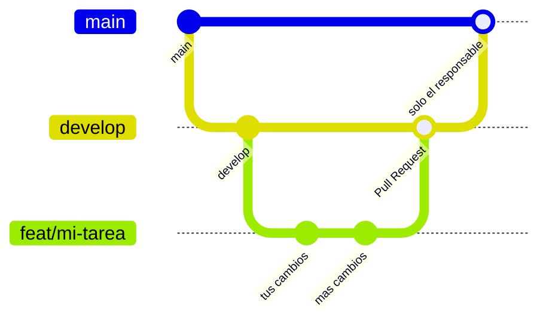

# Proyinstelec — App de campo + ERP

Aplicación web de Proyinstelec. Tiene dos partes que conviven en el mismo proyecto:

- **App de campo** (`/app`): los trabajadores hacen check-in y check-out con foto y
  geolocalización, incluso sin señal (funciona offline y sincroniza al recuperar conexión).
- **ERP** (`/erp`): cotizaciones, órdenes de trabajo y seguimiento semanal. Se está migrando
  por fases desde el sistema anterior hecho en Google Apps Script.

Los datos viven en Neon (PostgreSQL) y los archivos en Google Drive.

---

## Índice

1. [Qué necesitas antes de empezar](#1-qué-necesitas-antes-de-empezar)
2. [Instalar las herramientas](#2-instalar-las-herramientas)
3. [Preparar Visual Studio Code](#3-preparar-visual-studio-code)
4. [Clonar el repositorio](#4-clonar-el-repositorio)
5. [Instalar las dependencias](#5-instalar-las-dependencias)
6. [Configurar las variables de entorno](#6-configurar-las-variables-de-entorno)
7. [Preparar la base de datos](#7-preparar-la-base-de-datos)
8. [Arrancar el proyecto](#8-arrancar-el-proyecto)
9. [Cómo trabajar día a día](#9-cómo-trabajar-día-a-día-flujo-de-git)
10. [Antes de pedir revisión](#10-antes-de-pedir-revisión)
11. [Comandos disponibles](#11-comandos-disponibles)
12. [Problemas comunes](#12-problemas-comunes)
13. [Cómo está organizado el proyecto](#13-cómo-está-organizado-el-proyecto)
14. [Arquitectura](#14-arquitectura)
15. [Despliegue](#15-despliegue)
16. [El ERP y sus fases](#16-el-erp-y-sus-fases)

---

## 1. Qué necesitas antes de empezar

| Necesitas | Para qué | Cómo conseguirlo |
|---|---|---|
| **Node.js 20 o superior** | Ejecutar el proyecto | [nodejs.org](https://nodejs.org) — descarga la versión **LTS** |
| **pnpm 9** | Instalar las librerías | Se instala con un comando (ver abajo) |
| **Git** | Bajar y subir cambios | [git-scm.com](https://git-scm.com) |
| **Visual Studio Code** | Escribir el código | [code.visualstudio.com](https://code.visualstudio.com) |
| **Cuenta de GitHub** | Acceso al repositorio | Pídele acceso al responsable del proyecto |
| **Archivo `.env.local`** | Credenciales para correr la app | **Pídeselo al responsable del proyecto** — nunca está en el repositorio |

> **Importante:** el archivo con las credenciales (`.env.local`) **jamás** se sube al
> repositorio. Contiene contraseñas y llaves privadas. Si alguna vez lo ves aparecer en tus
> cambios pendientes, avisa antes de subir nada.

---

## 2. Instalar las herramientas

### En macOS

Abre la app **Terminal** y pega estos comandos, uno por uno:

```bash
# 1. Verifica si ya tienes Node instalado y qué versión
node --version
```

Si responde `v20.x.x` o mayor, ya lo tienes. Si dice "command not found" o una versión menor,
descarga el instalador **LTS** desde [nodejs.org](https://nodejs.org) y ejecútalo.

```bash
# 2. Instala pnpm (el gestor de librerías que usa este proyecto)
npm install -g pnpm@9

# 3. Verifica que quedó
pnpm --version     # debe decir 9.x.x

# 4. Verifica Git
git --version      # si no lo tienes, macOS te ofrecerá instalarlo
```

### En Windows

Abre **PowerShell** (búscalo en el menú inicio) y usa los mismos comandos. Antes descarga e
instala:

1. [Node.js LTS](https://nodejs.org) — deja todas las opciones por defecto.
2. [Git para Windows](https://git-scm.com/download/win) — en la pantalla *"Adjusting your PATH
   environment"* elige la opción recomendada (la de en medio).

Después, en PowerShell:

```powershell
node --version
npm install -g pnpm@9
pnpm --version
git --version
```

### Configura tu identidad en Git (una sola vez)

Para que tus cambios queden firmados con tu nombre:

```bash
git config --global user.name "Tu Nombre Completo"
git config --global user.email "tucorreo@proyinstelec.mx"
```

Usa **el mismo correo con el que entras a GitHub**, o tus commits no se asociarán a tu cuenta.

---

## 3. Preparar Visual Studio Code

### Extensiones recomendadas

Abre VS Code, presiona `Cmd+Shift+X` (Mac) o `Ctrl+Shift+X` (Windows) para abrir el panel de
extensiones, y busca e instala estas:

| Extensión | Para qué sirve |
|---|---|
| **ESLint** (`dbaeumer.vscode-eslint`) | Te marca errores de código mientras escribes |
| **Prettier** (`esbenp.prettier-vscode`) | Da formato al código automáticamente |
| **Tailwind CSS IntelliSense** (`bradlc.vscode-tailwindcss`) | Autocompleta las clases de estilos |
| **GitLens** (`eamodio.gitlens`) | Muestra quién cambió cada línea y cuándo |
| **Error Lens** (`usernamehw.errorlens`) | Muestra los errores directo sobre la línea |

### Ajuste útil

Presiona `Cmd+,` / `Ctrl+,` para abrir *Settings*, busca **"format on save"** y actívalo. Así el
código se acomoda solo cada vez que guardas, y los cambios que subas se ven ordenados.

---

## 4. Clonar el repositorio

"Clonar" es bajar una copia del proyecto a tu computadora.

```bash
# 1. Ve a la carpeta donde guardas tus proyectos (créala si no existe)
cd ~/Development

# 2. Descarga el proyecto
git clone https://github.com/memorp19/proyinstelec_check-in.git

# 3. Entra a la carpeta que se creó
cd proyinstelec_check-in

# 4. Cámbiate a la rama de trabajo (importante, ver sección 9)
git checkout develop
```

Si Git te pide usuario y contraseña al clonar, ten en cuenta que GitHub ya no acepta contraseñas:
necesitas un *Personal Access Token*. La forma más simple de evitar el trámite es instalar
[GitHub CLI](https://cli.github.com) y ejecutar `gh auth login` una vez; a partir de ahí Git te
autentica solo.

Ahora abre el proyecto en VS Code:

```bash
code .
```

(Si `code` no funciona, abre VS Code y usa *File → Open Folder* para elegir la carpeta.)

---

## 5. Instalar las dependencias

Las "dependencias" son las librerías que el proyecto necesita. Se instalan con un comando y
quedan en una carpeta `node_modules` que **no** se sube al repositorio.

```bash
pnpm install
```

Tarda un par de minutos la primera vez. Si termina sin errores, listo.

> Cada vez que alguien agregue una librería nueva y tú bajes esos cambios, vuelve a correr
> `pnpm install`. Si algo se comporta raro después de un `git pull`, ese es el primer remedio.

---

## 6. Configurar las variables de entorno

Las "variables de entorno" son los datos sensibles que la app necesita: la conexión a la base de
datos, las llaves de Google, etc. Viven en un archivo llamado `.env.local` que **no** está en el
repositorio.

```bash
# Crea tu archivo a partir de la plantilla
cp apps/web/.env.example apps/web/.env.local
```

Ahora abre `apps/web/.env.local` en VS Code y llena los valores. **Pídeselos al responsable del
proyecto** — no los inventes ni los copies de internet.

Las mínimas para que la app arranque:

| Variable | Qué es |
|---|---|
| `DATABASE_URL` | Conexión a la base de datos en Neon |
| `AUTH_SECRET` | Llave para firmar las sesiones. Genérala tú con `openssl rand -base64 32` |
| `AUTH_GOOGLE_ID` | Identificador de la app en Google (para el login) |
| `AUTH_GOOGLE_SECRET` | Su contraseña |

El resto (Google Drive, correo, carpetas del ERP) solo hace falta si vas a trabajar en esas
funciones. La lista completa y comentada está en
[`apps/web/.env.example`](apps/web/.env.example).

---

## 7. Preparar la base de datos

El proyecto usa **Neon**, una base de datos PostgreSQL en la nube. No necesitas instalar nada
localmente.

```bash
# Crea las tablas en la base a la que apunta tu DATABASE_URL
pnpm db:migrate

# Carga datos de prueba (usuarios, una empresa, un proyecto)
pnpm db:seed
```

> **Pregunta antes de correr esto:** confirma con el responsable a qué base apunta tu
> `DATABASE_URL`. Si por error apuntara a la base de producción, `db:seed` escribiría datos de
> prueba sobre datos reales. Lo normal es que trabajes contra una **rama de desarrollo** de Neon.

Si quieres ver el contenido de la base con una interfaz visual:

```bash
pnpm db:studio
```

---

## 8. Arrancar el proyecto

```bash
pnpm dev
```

Abre [http://localhost:3000](http://localhost:3000) en tu navegador. La app se recarga sola cada
vez que guardas un archivo.

Para detenerla: `Ctrl+C` en la terminal.

### Modo demo (sin credenciales ni base de datos)

Si todavía no tienes el `.env.local` y solo quieres ver las pantallas:

```bash
pnpm dev:demo
```

Entra con usuarios ficticios y datos falsos. Sirve para explorar la interfaz, **no** para
desarrollar funciones que toquen la base.

---

## 9. Cómo trabajar día a día (flujo de Git)

### Las tres reglas

1. **Nunca trabajes directamente en `main`.** Es la rama de producción y está protegida: solo el
   responsable del proyecto puede escribir en ella.
2. **Tu punto de partida siempre es `develop`.** Es la rama donde se integra el trabajo de todos.
3. **Cada tarea va en su propia rama**, y entra a `develop` mediante un *Pull Request* (una
   solicitud para que revisen y acepten tus cambios).



### Paso a paso de una tarea

#### Paso 1 — Ponte al día

Antes de empezar cualquier cosa, trae los cambios más recientes de tus compañeros:

```bash
git checkout develop     # cámbiate a develop
git pull                 # baja lo último
pnpm install             # por si alguien agregó librerías
```

#### Paso 2 — Crea tu rama

Una rama por tarea. El nombre debe decir qué hace:

```bash
git checkout -b feat/buscador-de-clientes
```

Convención de nombres:

| Prefijo | Cuándo usarlo | Ejemplo |
|---|---|---|
| `feat/` | Funcionalidad nueva | `feat/exportar-cotizaciones` |
| `fix/` | Corregir un error | `fix/fecha-de-entrega-vacia` |
| `docs/` | Solo documentación | `docs/guia-de-instalacion` |
| `refactor/` | Reordenar código sin cambiar comportamiento | `refactor/separar-validaciones` |

#### Paso 3 — Haz tus cambios

Edita los archivos en VS Code. Guarda con `Cmd+S` / `Ctrl+S`. Revisa el resultado en el navegador.

Para ver qué archivos llevas modificados:

```bash
git status
```

O usa el panel **Source Control** de VS Code (el icono de las ramitas en la barra lateral, o
`Cmd+Shift+G` / `Ctrl+Shift+G`): ahí ves la lista de archivos cambiados y, al hacer clic en uno,
el antes y el después lado a lado.

#### Paso 4 — Guarda tus cambios en un commit

Un *commit* es un punto de guardado con una descripción.

```bash
git add .                                        # marca todos tus cambios
git commit -m "feat: agregar buscador de clientes por RFC"
```

Cómo escribir el mensaje:

- Empieza con el mismo prefijo de la rama (`feat:`, `fix:`, `docs:`…).
- En español, en presente, explicando **qué** hace el cambio.
- ✅ `fix: corregir el cálculo de horas cuando la jornada cruza medianoche`
- ❌ `cambios`, `arreglos`, `wip`, `asdf`

Haz varios commits pequeños en lugar de uno gigante: es más fácil de revisar y de deshacer si algo
sale mal.

#### Paso 5 — Sube tu rama a GitHub

```bash
git push -u origin feat/buscador-de-clientes
```

(El `-u origin ...` solo la primera vez de cada rama. Después basta con `git push`.)

#### Paso 6 — Abre el Pull Request

1. Entra a [github.com/memorp19/proyinstelec_check-in](https://github.com/memorp19/proyinstelec_check-in).
2. Verás un aviso con tu rama y un botón **Compare & pull request**. Haz clic.
3. **Revisa que la base sea `develop`**, no `main`. Debe decir
   `base: develop  ←  compare: feat/tu-rama`.
4. Ponle un título claro y, en la descripción, explica qué cambiaste y cómo probarlo.
5. **Create pull request**.

Vercel construye automáticamente una vista previa de tu rama y deja el enlace como comentario en
el Pull Request: sirve para que quien revise vea tus cambios funcionando, sin bajar el código.

#### Paso 7 — Atiende los comentarios

Si te piden ajustes, haz los cambios en la misma rama y vuelve a `git add` / `git commit` /
`git push`. El Pull Request se actualiza solo.

Cuando lo aprueben, se integra a `develop` y tu tarea terminó.

### Si `develop` avanzó mientras trabajabas

Es normal que otros integren cambios antes que tú. Para traerlos a tu rama:

```bash
git checkout develop
git pull
git checkout feat/tu-rama
git merge develop
```

Si Git avisa de un **conflicto**, significa que dos personas tocaron las mismas líneas. VS Code te
muestra el archivo con las dos versiones y botones para elegir (*Accept Current* / *Accept
Incoming* / *Accept Both*). Elige lo correcto, guarda, y luego:

```bash
git add .
git commit -m "merge: integrar develop en la rama"
```

**Si el conflicto te da miedo, no adivines: pregunta.** Resolverlo mal puede borrar el trabajo de
alguien más.

### Lo que no debes hacer

- ❌ Trabajar en `main` o en `develop` directamente.
- ❌ `git push --force` (puede borrar el trabajo de otros).
- ❌ Subir el archivo `.env.local` o cualquier credencial.
- ❌ Subir la carpeta `node_modules` (ya está excluida, pero por si acaso).
- ❌ Commits con mensajes vacíos o sin sentido.

---

## 10. Antes de pedir revisión

Corre esto y asegúrate de que todo pase. Si algo falla, arréglalo antes de abrir el Pull Request:

```bash
pnpm test:ci     # las pruebas automáticas
pnpm lint        # el estilo del código
pnpm build       # que compile como en producción
```

Checklist rápido:

- [ ] Probé mi cambio en el navegador y hace lo que debe.
- [ ] Los tres comandos de arriba pasan sin errores.
- [ ] No estoy subiendo credenciales ni archivos de más (revisa `git status`).
- [ ] Mi Pull Request apunta a `develop`.
- [ ] Escribí en la descripción cómo probar lo que hice.

---

## 11. Comandos disponibles

```bash
# Desarrollo
pnpm dev              # arranca el proyecto en http://localhost:3000
pnpm dev:demo         # arranca sin Google ni base de datos (datos ficticios)
pnpm build            # compila como en producción
pnpm lint             # revisa el estilo del código

# Pruebas
pnpm test             # se queda corriendo y repite las pruebas al guardar
pnpm test:ci          # una sola pasada, con reporte de cobertura

# Base de datos
pnpm db:migrate       # aplica los cambios de estructura pendientes
pnpm db:generate      # genera una migración nueva tras cambiar el esquema
pnpm db:studio        # explorador visual de los datos
pnpm db:seed          # carga datos de prueba

# Importación desde el sistema anterior
pnpm import:erp                 # trae datos de las hojas de cálculo
DRY_RUN=true pnpm import:erp    # solo reporta lo que haría, sin escribir
```

---

## 12. Problemas comunes

| Síntoma | Causa probable | Solución |
|---|---|---|
| `command not found: pnpm` | pnpm no está instalado | `npm install -g pnpm@9` |
| `Falta DATABASE_URL` | No creaste `.env.local` o está vacío | Revisa el paso 6 |
| `relation "users" does not exist` | La base no tiene las tablas | `pnpm db:migrate` |
| Errores raros después de un `git pull` | Faltan librerías nuevas | `pnpm install` |
| El navegador muestra la versión vieja | Caché del navegador | Recarga con `Cmd+Shift+R` / `Ctrl+F5` |
| `Cannot find module` al arrancar | Instalación incompleta | Borra `node_modules` y corre `pnpm install` |
| No puedo subir a `main` | Es correcto: está protegida | Trabaja en tu rama y abre un Pull Request a `develop` |
| `redirect_uri_mismatch` al entrar con Google | Falta registrar la URL en Google | Avisa al responsable |

Si nada de esto lo resuelve, **pregunta**. Perder media hora atorado es normal; perder dos días en
silencio, no.

---

## 13. Cómo está organizado el proyecto

```
.
├── apps/
│   └── web/                    # La aplicación (todo el código que vas a tocar)
│       ├── app/                # Páginas y rutas de API
│       │   ├── app/            #   -> /app     pantallas de campo (check-in/out)
│       │   ├── admin/          #   -> /admin   panel de administración
│       │   ├── erp/            #   -> /erp     módulos del ERP
│       │   ├── cliente/        #   -> /cliente portal de clientes
│       │   └── api/            #   -> rutas de API (el "backend")
│       ├── src/
│       │   ├── db/             # Esquema de la base de datos y conexión
│       │   ├── lib/            # Lógica de negocio (lo importante vive aquí)
│       │   ├── __tests__/      # Pruebas automáticas
│       │   ├── auth.ts         # Inicio de sesión
│       │   └── auth.config.ts  # Configuración de sesión para el middleware
│       ├── drizzle/            # Migraciones de la base (generadas, no se editan a mano)
│       └── public/             # Imágenes e iconos
├── scripts/                    # Utilidades: siembra e importación
└── docs/                       # Documentación del proyecto
```

**Dónde tocar según lo que vayas a hacer:**

- ¿Cambiar cómo se ve una pantalla? → `apps/web/app/...`
- ¿Cambiar una regla de negocio? → `apps/web/src/lib/...`
- ¿Agregar o cambiar una tabla? → `apps/web/src/db/schema.ts`, luego `pnpm db:generate`
- ¿Agregar una prueba? → `apps/web/src/__tests__/...`

---

## 14. Arquitectura

### Stack

| Capa | Tecnología |
|---|---|
| Frontend | Next.js 14 (App Router) · TypeScript · Tailwind CSS |
| Autenticación | Auth.js v5 · Google OAuth · adaptador Drizzle |
| Base de datos | Neon (PostgreSQL serverless) · Drizzle ORM |
| Almacenamiento | Google Drive (service account) |
| Correo | Gmail API (delegación de dominio) |
| Hosting | Vercel |
| Offline | IndexedDB · Background Sync |
| Pruebas | Vitest |
| Monorepo | pnpm workspaces |

### Flujo de check-in / check-out

```
Trabajador abre /app
       |
       v
[Foto obligatoria]  --con señal-->  POST /api/upload  ->  Google Drive
       |                                                       | id del archivo
       v                                                       v
[Geolocalización]            POST /api/jornada  ->  Neon (jornada abierta)
       |                          |
       |                     sincroniza con Odoo (solo personal de planta)
       v
[Check-out]  --con señal-->  PATCH /api/jornada/:id  ->  Neon (jornada cerrada)
       |
  sin señal  ->  se guarda en el navegador (IndexedDB)  ->  se envía al recuperar conexión
```

### Modelo de datos

El esquema está en `apps/web/src/db/schema.ts` (19 tablas):

| Grupo | Tablas |
|---|---|
| Sesiones | `users`, `accounts`, `sessions`, `verification_tokens` |
| Campo | `empresas`, `proyectos`, `proyecto_usuarios`, `invitaciones`, `jornadas`, `odoo_queue` |
| ERP | `clientes`, `contactos`, `cotizaciones`, `aprobaciones`, `ordenes_trabajo`, `ot_responsables` |
| Comunes | `bitacora`, `contadores`, `config_erp` |

La versión vigente de una cotización es la de mayor `version` por `(numero, anio)` — se resuelve
con una consulta, sin las filas ocultas que necesitaba el sistema anterior.

### Roles y permisos

| `tipo` | `rol` | Qué puede hacer |
|---|---|---|
| `admin` | `admin` | Todo; incluye todos los permisos del ERP |
| `planta` | `campo` | Trabajador con correo `@proyinstelec.mx`; se sincroniza con Odoo |
| `temporal` | `campo` | Trabajador externo; entra por invitación |
| `cliente` | `cliente` | Solo consulta de sus proyectos |

Además del rol, cada persona puede tener permisos finos del ERP (campo `permisos` del perfil;
catálogo en `apps/web/src/lib/permisos.ts`). Se editan en **Admin → Usuarios → ERP** y se validan
siempre en el servidor con `exigirPermiso()`. Esconder un botón en la pantalla **no** es
protección: la verdadera va en la ruta de API.

### Super administradores

La lista está en [`apps/web/src/lib/super-admins.ts`](apps/web/src/lib/super-admins.ts). Estas
cuentas reciben rol de administrador automáticamente al entrar, pueden administrar usuarios y
ninguna otra cuenta puede degradarlas. Es la única lista de personas que vive en el código; todo
lo demás se administra desde la aplicación.

### Identidad

Auth.js administra el inicio de sesión: el identificador de Google se guarda en la tabla
`accounts` y el identificador interno de la persona es `users.id`. Si a alguien se le da de alta
por adelantado (por siembra o importación), al entrar con Google se enlaza por correo y conserva
su rol y sus permisos.

---

## 15. Despliegue

Vercel (hosting) + Neon (base de datos). La rama `main` se publica en producción y cada Pull
Request genera su propia vista previa.

Guía completa: [`docs/despliegue-vercel-neon.md`](docs/despliegue-vercel-neon.md).

---

## 16. El ERP y sus fases

El ERP interno (cotizaciones, órdenes de trabajo y seguimiento semanal) se migra por fases desde
el sistema anterior en Google Apps Script. Plan y decisiones:
[`docs/plan-migracion-erp.md`](docs/plan-migracion-erp.md). Análisis del sistema anterior:
[`docs/erp-legacy/`](docs/erp-legacy/).

**Fase 0 — Fundamentos (lista)**

- Permisos del ERP en el perfil (`permisos`, `iniciales`, `gerencia`), editables en
  **Admin → Usuarios → ERP**. Catálogo y verificación en `apps/web/src/lib/permisos.ts`.
- Sección `/erp` con menú filtrado por permisos.
- Folios con numeración atómica (`src/lib/folios.ts`), bitácora de auditoría
  (`src/lib/bitacora.ts`) y correo transaccional por Gmail API (`src/lib/correo.ts`; en
  desarrollo se deja `CORREO_DESHABILITADO=true` para no mandar correos de verdad).

**Fase 1 — Clientes y Cotizaciones (lista)**

- `/erp/clientes`: empresas y contactos, con detección de duplicados por razón social.
- `/erp/cotizaciones`: buscador con los ocho filtros del sistema anterior; alta con carpeta en
  Drive y copia de plantillas; versiones; flujo completo de revisión → aprobación → envío al
  cliente (con PDF obligatorio) → ingreso de orden de compra → generación de la OT.
- `/erp/revision`: bandeja para aprobar o pedir correcciones. Sustituye los enlaces sin
  autenticación que usaba el sistema anterior.
- Importador desde las hojas de cálculo: `pnpm import:erp`.

**Fases siguientes:** Órdenes de Trabajo y Control Operativo (2), Weekly y seguimiento (3),
KPIs y tableros (4).

### Configuración adicional del ERP

- **Drive:** `ERP_COTIZACIONES_FOLDER_ID`, `ERP_OT_FOLDER_ID`, `ERP_PLANTILLA_DOC_ID` y
  `ERP_PLANTILLA_SHEET_ID`.
- **Correo:** `CORREO_REMITENTE` y, si se usa una llave distinta a la de Drive,
  `GMAIL_SERVICE_ACCOUNT_KEY`. Requiere habilitar la delegación de dominio del service account en
  la consola de administrador de Google Workspace con el scope
  `https://www.googleapis.com/auth/gmail.send`.
